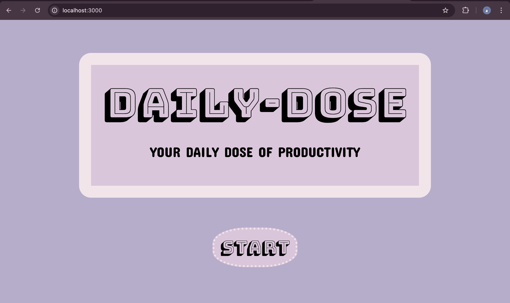
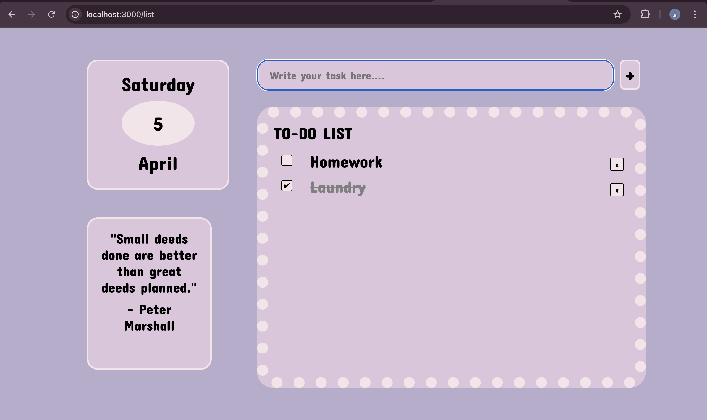

🌟 Daily Dose – To-Do List Web Application

📌 Project Objective
Daily Dose is a clean, interactive, and user-friendly To-Do List Web Application designed to help users manage and organize their daily tasks efficiently.
The app provides a minimalistic design with a smooth two-step interaction flow:
* Landing Page :
  -> Displays the Daily Dose logo and a “Start” button
  -> On clicking “Start,” users are redirected to the task management page
* Task Management Page :
  -> hows the current day, date, and month
  -> Allows users to add tasks via an input field and “+” button
  -> Displays tasks in a list format
  -> Users can mark tasks as completed using checkboxes

This project showcases full-stack development skills, with an emphasis on UI/UX, dynamic content rendering, and routing.

Features:
🎯 Simple two-page flow: Landing → Task Manager
📅 Real-time display of current date and day
➕ Add tasks with input and "+" button
✅ Mark tasks as complete using checkboxes
🧩 Dynamic rendering using EJS templating

🛠️ Tech Stack
* Frontend: HTML, CSS, JavaScript (EJS)
* Backend: Node.js, Express.js
* Templating Engine: EJS
* Storage: In-memory array (temporary)

📸 Screenshots

### 🏠 Landing Page

### 📝 Task Page

🙌 Acknowledgements :
This project was built to gain hands-on experience with full-stack web development and demonstrate an understanding of routing, templating, and user interaction through a real-world use case.

